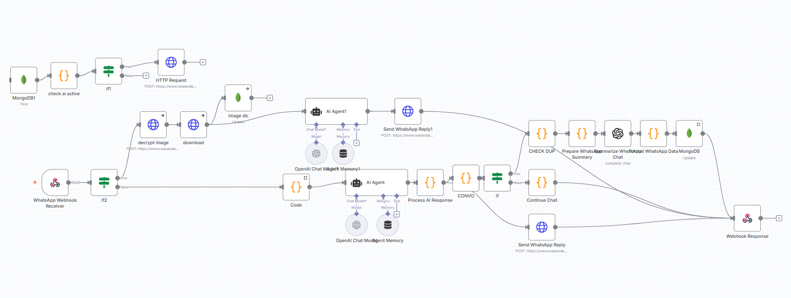

# 🎨 INKFLOW - AI-Powered WhatsApp Bot for Tattoo Artists



  

## 📱 What is INKFLOW?

INKFLOW is a complete WhatsApp automation system designed specifically for tattoo artists and studios. It uses AI to handle client consultations, gather tattoo ideas, collect client information, and manage the entire pre-booking process automatically through WhatsApp.

## 🌟 Key Features

### 🤖 Intelligent AI Assistant
- **Smart Conversation Flow**: Guides clients through the consultation process
- **Hebrew Language Support**: Fully optimized for Hebrew-speaking clients
- **Style Expertise**: Specialized in Realism and Fine-line tattoo styles
- **Natural Responses**: Conversational, friendly tone that feels human

### 📸 Image Processing
- **Image Analysis**: AI analyzes reference images sent by clients
- **Automatic Storage**: Images are stored in MongoDB with metadata
- **Caption Extraction**: Reads text captions from images

### 📊 Client Management
- **Automatic Data Collection**: Extracts client name, phone, tattoo ideas
- **MongoDB Integration**: Stores all client information in database
- **Conversation History**: Maintains full chat history for each client
- **Session Management**: Tracks multiple conversations per client

### 🎯 Smart Triggers
- **Completion Detection**: Automatically detects when consultation is complete
- **Summary Generation**: Creates professional summaries for the artist
- **Anti-Duplication**: Prevents duplicate entries and messages

## 🛠️ Technical Architecture

### Core Components
1. **WhatsApp Webhook**: Receives messages from WhatsApp Business API
2. **AI Agent (GPT-4)**: Processes conversations and generates responses
3. **MongoDB Database**: Stores client data and conversation history
4. **Image Processing**: Handles media downloads and analysis
5. **Smart Routing**: Determines when to trigger summaries vs continue chat

### Workflow Structure
```
WhatsApp Message → Image Detection → AI Processing → Response Generation → Database Storage → Summary (if complete)
```

## 🚀 Setup Instructions

### Prerequisites
- n8n instance (cloud or self-hosted)
- OpenAI API key (GPT-4 access)
- MongoDB database
- WhatsApp Business API (Wasender or similar)

### Installation Steps

1. **Import the Workflow**
   ```bash
   # Download the workflow file
   wget https://raw.githubusercontent.com/davebruzil/INKFLOW-n8n-/main/IMAGE%20(2).json

   # Import in n8n dashboard: Settings → Import from File
   ```

2. **Configure Credentials**
   - OpenAI API Key
   - MongoDB connection string
   - WhatsApp API credentials

3. **Set Up Webhook**
   - Copy the webhook URL from n8n
   - Configure in your WhatsApp Business API provider

4. **Customize AI Prompts**
   - Edit the system message in AI Agent nodes
   - Adjust conversation flow for your studio's style

## 💬 How It Works for Clients

### Initial Contact
```
Client: "Hi, I want a tattoo"
Bot: "Hey! How can I help? Do you have a tattoo idea or want to start a consultation with the artist? 😊"
```

### Information Gathering
```
Client: "I want a lion tattoo"
Bot: "Sounds interesting! 🙂
First - what's your name? Please send me your full name."

Client: "David"
Bot: "What size are you thinking? (small/medium/large or in cm)"

Client: "Medium size"
Bot: "Where were you thinking of placing it?"

Client: "On my arm"
Bot: "Perfect David! I'll pass your details to the artist and we'll get back to you soon. Thanks! 🙏"
```

## 📋 Features for Tattoo Artists

### Client Information Collection
- ✅ Full name
- ✅ Phone number
- ✅ Tattoo idea description
- ✅ Size preferences
- ✅ Placement location
- ✅ Reference images (if provided)
- ✅ Style compatibility check

### AI Control System
- **ON/OFF Switch**: Enable/disable AI for specific clients
- **Human Takeover**: Switch to manual responses when needed
- **Conversation Monitoring**: Full chat history available

### Database Features
- Client profiles with all consultation data
- Image gallery for each client
- Conversation timestamps
- Summary generation for quick review

## 🎨 Specialized for Tattoo Industry

### Style Expertise
- **Realism Focus**: AI understands realistic tattoo requirements
- **Fine-line Specialization**: Optimized for delicate, detailed work
- **Style Compatibility**: Redirects incompatible styles (manga, graffiti, etc.)

### Professional Language
- Casual but professional Hebrew responses
- Tattoo industry terminology
- Clear consultation process

### Business Integration
- Seamless handoff to human artist
- Professional summary generation
- Client expectation management

## 📊 Analytics & Monitoring

### Conversation Metrics
- Total conversations handled
- Completion rates
- Common client requests
- Response times

### Client Insights
- Popular tattoo styles
- Size preferences
- Placement trends
- Image analysis results

## 🔧 Customization Options

### Modify AI Personality
Edit the system prompt in the AI Agent nodes to:
- Change conversation tone
- Add studio-specific information
- Modify questioning sequence
- Update style specializations

### Adjust Completion Triggers
Customize when summaries are generated:
- Client name collection
- Specific keywords
- Conversation length
- Time-based triggers

### Database Schema
Extend client data collection:
- Additional fields
- Custom metadata
- Integration with booking systems
- CRM connections

## 🌍 Multi-Language Support

Currently optimized for Hebrew, but easily adaptable for:
- English
- Spanish
- Portuguese
- Any language with GPT-4 support

## 🔐 Privacy & Security

- **No Data Leaks**: All conversations stay in your database
- **GDPR Compliant**: Client data handling follows privacy standards
- **Secure APIs**: Encrypted connections to all services
- **Access Control**: AI can be disabled per client

## 📞 Support & Community

- **Issues**: Report bugs on GitHub Issues
- **Features**: Request features via GitHub Discussions
- **Documentation**: Full setup guides in Wiki
- **Community**: Join our tattoo artist automation community

# License

Proprietary - Commercial use only with written permission